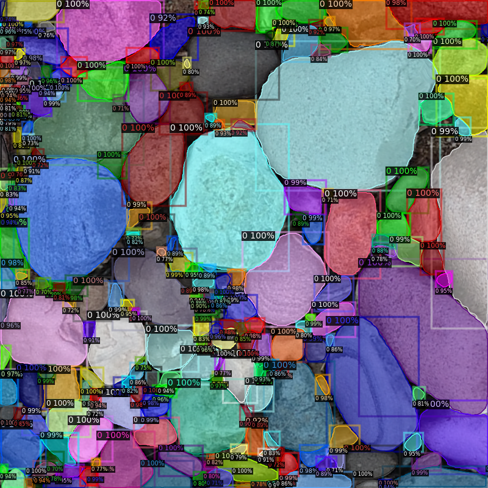
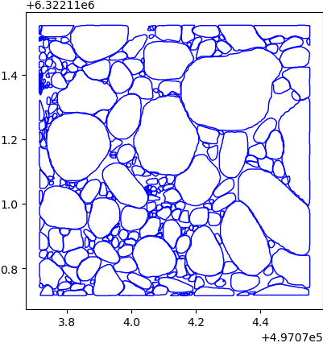
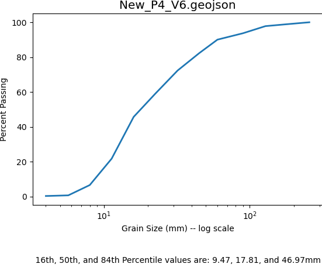
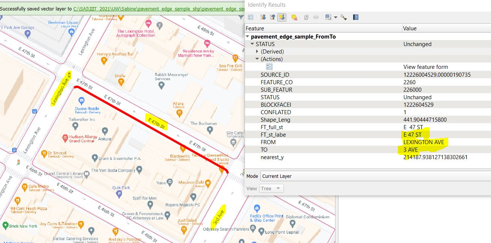
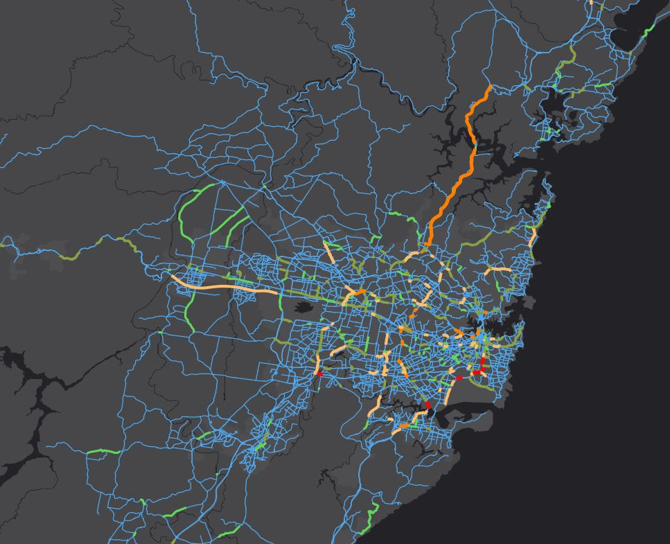

# Selected Freelance Case Studies

These examples summarize independent technical assignments. Client names,
private source data, credentials and environment-specific notebooks are
omitted. Visuals are illustrative outputs; detailed evidence can be shared
where permitted.

## UAV Grain-Size Analysis

A geospatial computer-vision workflow for high-resolution UAV imagery of
riverbeds and sediment environments.

**Problem:** Identify individual pebbles and boulders and turn imagery into
measurements useful for fluvial geomorphology and river-restoration work.

**Approach:** Detectron2 Mask R-CNN instance segmentation, confidence review,
CRS-aware polygon conversion, GeoJSON/Shapefile export, minor-axis grain
measurements, percentile statistics, cumulative grain-size distributions and
CSV summaries.

**Outcome:** A domain workflow from UAV imagery to measurable clasts,
GIS-ready features and quantitative geomorphological evidence.

## Large-Scene Satellite Segmentation

A memory-aware workflow for applying models trained on 512 x 512 chips to
large georeferenced satellite rasters.

**Problem:** Run semantic segmentation at scene scale without exhausting
memory or losing the source raster's spatial reference.

**Approach:** GDAL tiling, MMSegmentation inference, GeoTIFF metadata
preservation, mask-to-polygon conversion, coordinate transformation and
GeoPandas scene-level export.

**Outcome:** Georeferenced prediction rasters and GIS-ready vector features
from a research-scale model.

## Street-Segment Blockface Enrichment

A batch geoprocessing workflow for enriching pavement-edge street segments.

**Problem:** Add `ON`, `FROM`, `TO` and `SIDE` fields to a large street-segment
dataset so each feature has a human-readable blockface description.

**Approach:** Reconcile street topology, line direction, intersection
geometry, cross-street ordering and side-of-street semantics in a repeatable
batch process.

**Outcome:** A complete Shapefile delivery package and a reviewable GIS result
for transportation and urban-data workflows.

## Municipal Infrastructure Evidence

A field-to-GIS evidence workflow for municipal infrastructure maintenance.

**Problem:** Convert field photographs into a spatial record that can be
reviewed as contract-completion evidence.

**Approach:** Extract geolocation, capture time, altitude and camera bearing;
create a spatial layer; support directional visualization and map-linked
photo review; package the GIS deliverable with its required sidecars.

**Outcome:** A traceable field-survey evidence product connecting mapped
observations to source photographs. Client-specific photographs and archives
remain private.

## Offline Administrative Reverse Geocoding

A lightweight offline architecture for resolving city, state and country from
latitude/longitude coordinates.

**Problem:** Avoid nearest-city errors near administrative boundaries without
deploying a heavyweight general-purpose geocoder.

**Approach:** Extract relevant OSM administrative polygon/multipolygon data,
reduce the dataset to the required attributes, evaluate Spatialite/SQLite and
apply point-in-polygon lookup.

**Outcome:** A compact offline database-oriented foundation for administrative
reverse geocoding.

## Texas ZCTA Demographic Dataset

A data-research and preparation assignment for Texas demographic analysis.

**Problem:** Link ZCTA boundary polygons to basic demographic statistics.

**Approach:** Select authoritative Census/TIGER and ACS sources, use GEOIDs to
join geometry to ACS variables, distinguish estimates from margins of error,
filter to Texas and clean the selected fields.

**Outcome:** A focused, portable Texas demographic GIS package rather than a
large unfiltered national source dataset.

## Traffic-Volume Web Mapping

A data-integration workflow for ArcGIS Online traffic visualization.

**Problem:** Align traffic-volume observations with road geometry and render
traffic classes with a green-to-red scale.

**Approach:** Validate schemas and CRS, project data for spatial operations,
snap misaligned points to roads, buffer and intersect, spatially join traffic
values to road features, classify volumes and package the layer for web-map
publication.

**Outcome:** A GIS-ready traffic layer suitable for ArcGIS Online inspection,
filtering and analysis.

## Scientific Web Mapping

A front-end architecture for rendering scientific raster data in a custom
OpenLayers website.

**Problem:** Make GRIB sea-surface-temperature data usable in an interactive
browser map.

**Approach:** Decode GRIB variables and spatial metadata, convert the grid to a
web-renderable layer, preserve extent and no-data semantics, apply a
scientific colour ramp and expose map interaction and inspection.

**Outcome:** A browser-facing scientific visualization that connects data
processing with an interactive geospatial user experience.

## IP Data Enrichment

A batch-oriented business-data enrichment workflow.

**Problem:** Add IP-derived geographic/network information and compare it with
an existing reported location.

**Approach:** Resolve IP metadata, geocode the existing location field,
calculate geographic distance and produce structured CSV output.

**Outcome:** An enriched analytical dataset for geographic comparison and
quality review. Private client data and provider credentials are excluded.

## Technical Capability Assessment

A structured assessment deliverable for a training agency building Big Data
course and job-family recommendations.

**Problem:** Convert course and role requirements into a usable competency
matrix.

**Approach:** Categorize skills as prerequisite, fundamental or advanced and
rate their importance for each role as least, moderate, most important or not
required.

**Outcome:** An assessment-ready KSA mapping framework for course and
job-family recommendations.

## Public Evidence Policy

The public repository contains summaries and selected visual outputs only.
Private notebooks, client datasets, credentials, raw field photographs,
contract archives and environment-specific paths are retained separately.
